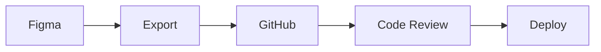

# 📚 Documentación del Proyecto - Instituto DVS Web

## 🎯 Filosofía: "Documentación como Código"

La documentación evoluciona junto al proyecto, es versionada y siempre actualizada.

**Beneficios:**
- **Onboarding rápido:** nuevos devs entienden el proyecto en minutos
- **Handoff fluido:** diseñadores y developers hablan el mismo idioma
- **Mantenimiento:** código autodocumentado y decisiones rastreables

## 🔗 Referencias del Proyecto

### **Identidad Institucional**
- **Instagram Oficial:** [@inst_dvs](https://www.instagram.com/inst_dvs?igsh=YzljYTk1ODg3Zg==)

### **Benchmarks UX/UI**
- **RAE:** [rae.es](https://www.rae.es/) - Diseño institucional, tipografía clara
- **Worcester Academy:** [worcesteracademy.org](https://www.worcesteracademy.org/about) - Estructura educativa, navegación
- **Blundells:** [blundells.org](https://www.blundells.org/) - Layout responsive, jerarquía visual
- **Maristas Luján:** [maristaslujan.edu.ar](https://maristaslujan.edu.ar/) - Contexto local educativo

### **Recursos de Diseño**
- **Paleta de Colores:** [Propuesta inicial](https://claude.ai/public/artifacts/f2ac2f09-dad0-4c39-beb7-794c07aa81bc)
- **Coolors Generator:** [Paletas complementarias](https://coolors.co/2669bb-1867e5-018bfb-ccc3ae-1a4f95)

## 🗂️ Estructura del Repositorio

```
instituto-dvs-web/
├── 📄 README.md                    # Overview del proyecto
├── 📁 docs/
│   ├── 📄 figma-guide.md           # → Guía práctica de Figma para devs
│   ├── 📄 UX_PRINCIPLES.md         # → Principios UX/UI educativo accesible
│   ├── 📄 DESIGN_SYSTEM.md         # Design tokens y componentes
│   ├── 📄 ACCESSIBILITY.md         # WCAG 2.1 AA compliance
│   ├── 📄 COMPONENT_SPECS.md       # Mapping Figma → React
│   └── 📁 assets/
│       ├── screenshots/            # Capturas finales
│       ├── benchmarks/            # Referencias de diseño
│       └── user-flows/            # Diagramas de flujo
├── 📁 figma-exports/
│   ├── icons/                     # SVGs optimizados
│   ├── images/                    # Assets gráficos
│   └── design-tokens.json         # Tokens exportados
└── 📄 CONTRIBUTING.md              # Guía para colaboradores
```

## 🎯 Enfoque UX/UI: Comodidad del Usuario Educativo

### 👥 Audiencias Críticas
**🧑‍🎓 Estudiantes (12-18 años)**
- Expectativa: Interfaces rápidas e intuitivas
- Necesidad: Acceso inmediato a información académica
- Prioridad: Mobile-first, navegación simple

**👨‍👩‍👧 Padres/Tutores (35-50 años)** 
- Expectativa: Claridad e información confiable
- Necesidad: Comunicación institucional transparente
- Prioridad: Accesibilidad, texto legible, contacto fácil

**👩‍🏫 Docentes (25-65 años)**
- Expectativa: Eficiencia en tareas administrativas
- Necesidad: Herramientas funcionales cross-device
- Prioridad: Interfaces sin fricción, feedback claro

### 🌟 Principios UX Fundamentales

#### **1. PERCEPTIBILIDAD** - "Todo debe verse claramente"
- **Contraste visual institucional:** 4.5:1 mínimo
- **Paleta accesible:** Azul institucional `#1E40AF`, Verde académico `#059669`
- **Información multi-canal:** No depender solo del color
- **Contenido multimedia:** Subtítulos + transcripciones

#### **2. OPERABILIDAD** - "Todo debe funcionar fácil"
- **Navegación táctil:** Targets mínimo 44px en móvil
- **Control por teclado:** Tab order lógico, focus visible
- **Sin presión temporal:** Formularios sin límites de tiempo

#### **3. COMPRENSIBILIDAD** - "Todo debe ser claro"
- **Lenguaje directo:** "Ver materiales" vs "Repositorio académico"
- **Navegación predecible:** Estructura consistente
- **Manejo de errores:** Mensajes específicos con solución

#### **4. ROBUSTEZ** - "Todo debe funcionar siempre"
- **HTML semántico:** Estructura correcta para lectores
- **Compatibilidad:** Funciona en todos los navegadores
- **Progressive enhancement:** Contenido base sin JavaScript

## 📋 Documentos de Trabajo

### UX_PRINCIPLES.md - Guía de Experiencia Usuario
```markdown
# 🎨 UX/UI Educativo - Instituto DVS

## Mobile-First Strategy
80% padres usan móvil → diseñar primero para 320px-768px

## Jerarquía Visual Clara
- H1: 48px/32px (desktop/mobile), peso 700
- Body: 16px/14px, peso 400  
- Touch targets: 44px mínimo

## Estados Interactivos
- Default, Hover, Focus, Active, Disabled
- Focus visible: outline 2px color primario
```

### DESIGN_SYSTEM.md - Tokens y Componentes
```markdown
# 🎨 Design System - Instituto DVS

## 🔗 Figma: [Link](figma-url) | Instagram: [@inst_dvs](instagram-url)

## Tokens Accesibles
```css
:root {
  --primary: #1E40AF;    /* Contraste 8.1:1 ✅ */
  --secondary: #059669;  /* Contraste 5.2:1 ✅ */
  --error: #DC2626;      /* Contraste 5.9:1 ✅ */
}
```

## Componentes Base
- Button: variants (primary, secondary) + estados accesibles
- Card: estructura semántica para noticias/materias
- Navigation: keyboard accessible + ARIA labels
```

### ACCESSIBILITY.md - WCAG Compliance
```markdown
# ♿ Accesibilidad WCAG 2.1 AA

## Testing Tools
- Figma: Stark plugin (contraste)
- Browser: axe DevTools, Lighthouse
- Screen readers: NVDA, VoiceOver

## Checklist Crítico
- [ ] Contraste 4.5:1 en todo el texto
- [ ] Alt text descriptivo en imágenes  
- [ ] Navegación completa por teclado
- [ ] Skip links implementados
- [ ] ARIA labels en elementos complejos
```

## 🔄 Workflow de Sincronización



## 🏆 Impacto en la Comodidad del Usuario

**Para Estudiantes:**
- Acceso inmediato a información desde móvil
- Interfaces que no requieren aprendizaje
- Navegación intuitiva sin fricción

**Para Padres:**
- Información clara y confiable
- Contacto institucional fácil
- Textos legibles en cualquier dispositivo

**Para Docentes:**
- Herramientas administrativas eficientes
- Interfaces que funcionan en todos los dispositivos
- Menos tiempo en tareas, más en enseñanza

## ✅ Setup del Proyecto

### Semana 1 - Fundación:
- [ ] Crear repo con estructura documentada
- [ ] Completar [Guía de Figma](docs/figma-guide.md)
- [ ] Definir UX principles basados en audiencias
- [ ] Análisis de benchmarks educativos

### Durante desarrollo:
- [ ] Actualizar COMPONENT_SPECS con cada componente
- [ ] Testing de accesibilidad continuo
- [ ] Validación con usuarios reales (estudiantes, padres, docentes)

### Pre-launch:
- [ ] Audit completo WCAG 2.1 AA
- [ ] Testing cross-device y cross-browser
- [ ] Documentación de handoff completa

**La comodidad del usuario es el éxito del proyecto educativo.**